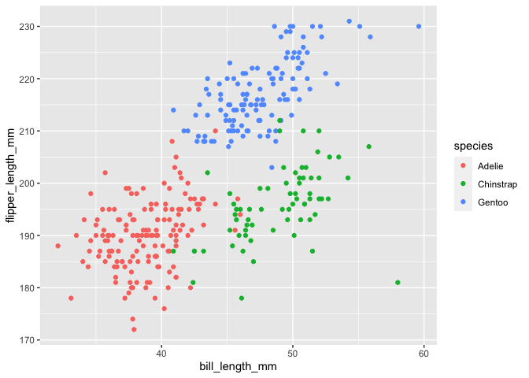

HW 1
================
Kristina Howell
9/13/2020

### Question 1

The following code creates a dataframe (titled df\_1) consisting of a
numeric vector, a logic vector, a character vector, and a three level
factor vector. The contents of the dataframe are displayed after.

``` r
library(tidyverse)
```

``` r
df_1 = 
  tibble(
       vec_rand = rnorm(10),
       vec_logic = vec_rand > 0,
       vec_char = c("A", "B", "C", "D", "E", 
                    "F", "G", "H", "I", "J"),
       vec_factor = factor(c("mild","mild","mild","mild",
                             "moderate", "moderate", "moderate",
                             "severe", "severe", "severe"))
  )

df_1
```

    ## # A tibble: 10 x 4
    ##    vec_rand vec_logic vec_char vec_factor
    ##       <dbl> <lgl>     <chr>    <fct>     
    ##  1   -0.425 FALSE     A        mild      
    ##  2   -1.63  FALSE     B        mild      
    ##  3    0.632 TRUE      C        mild      
    ##  4    0.784 TRUE      D        mild      
    ##  5    1.62  TRUE      E        moderate  
    ##  6    0.874 TRUE      F        moderate  
    ##  7    0.277 TRUE      G        moderate  
    ##  8   -0.829 FALSE     H        severe    
    ##  9    0.133 TRUE      I        severe    
    ## 10   -0.985 FALSE     J        severe

The following code attempts to take the mean of each vector. It displays
two possible ways to code the calculation of a vec\_rand.

``` r
mean(pull(df_1,vec_rand)) 
```

    ## [1] 0.04500675

``` r
mean(df_1$vec_rand)
```

    ## [1] 0.04500675

``` r
mean(df_1$vec_logic)
```

    ## [1] 0.6

``` r
mean(df_1$vec_char)
```

    ## Warning in mean.default(df_1$vec_char): argument is not numeric or logical:
    ## returning NA

    ## [1] NA

``` r
mean(df_1$vec_factor)
```

    ## Warning in mean.default(df_1$vec_factor): argument is not numeric or logical:
    ## returning NA

    ## [1] NA

The mean is calculated for the random sample vector (vec\_rand) and the
logic vector (vec\_logic). The code produces an error for the character
vector (vec\_char) and the factor vector (vec\_factor).

The following code chunk applies the as.numeric function to the logical,
character, and factor variables. The output is omitted.

``` r
as.numeric(df_1$vec_logic)
as.numeric(df_1$vec_char)
as.numeric(df_1$vec_factor)
```

The output computes the vectors into numeric functions. For example, the
logic vector changes to 0 and 1 based on the true/ false status of each
entry. The character vector outputs all NA. The factor vector changes
each level to 1, 2, and 3, respectively. These changes allow R to then
perform calculations on the vectors as if they were numeric functions.

The following code chunk performs various procedures, as outlined in the
comments.

``` r
#Convert the logical vector to numeric and multiply the random sample by the result.
as.numeric(df_1$vec_logic)*(df_1$vec_rand)
```

    ##  [1] 0.0000000 0.0000000 0.6316574 0.7841583 1.6159079 0.8743398 0.2773330
    ##  [8] 0.0000000 0.1332703 0.0000000

``` r
#Convert the logical vector to a factor and multiply the random sample by the result.
as.factor(df_1$vec_logic)*(df_1$vec_rand)
```

    ## Warning in Ops.factor(as.factor(df_1$vec_logic), (df_1$vec_rand)): '*' not
    ## meaningful for factors

    ##  [1] NA NA NA NA NA NA NA NA NA NA

``` r
#convert the logical vector to a factor and then convert the result to numeric, and multiply the random sample by the result
vec_logic_2 <- as.factor(df_1$vec_logic)
as.numeric(vec_logic_2)*(df_1$vec_rand)
```

    ##  [1] -0.4249312 -1.6276706  1.2633149  1.5683166  3.2318157  1.7486797
    ##  [7]  0.5546659 -0.8287467  0.2665407 -0.9852506

### Question 2

Load the penguins dataset:

``` r
data("penguins", package = "palmerpenguins")
```

The penguin dataset includes the variables: species, island,
bill\_length\_mm, bill\_depth\_mm, flipper\_length\_mm, body\_mass\_g,
sex, year. The dataset variables address demographic and individual
aspects of the penguins examined. The penguins dataset consists of 344
rows and 8 columns. The mean flipper length is 200.9152047.

The following code creates a scatterplot comparing bill length in mm to
flipper length in mm by species.

``` r
ggplot(penguins, aes(x = bill_length_mm, 
                     y = flipper_length_mm, 
                     color = species)) + geom_point()
```

    ## Warning: Removed 2 rows containing missing values (geom_point).

<!-- -->

``` r
ggsave(filename = "bill_flipper.pdf",
       plot = last_plot())
```

    ## Saving 7 x 5 in image

    ## Warning: Removed 2 rows containing missing values (geom_point).
